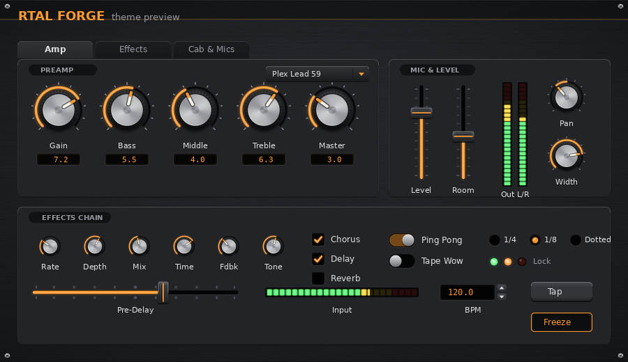

# RTAL Forge: bitmap theme for Faust plugin dialogs

This is a complete set of bitmaps for replacing the standard toolkit graphics of a Faust-generated dialog. It covers knobs, sliders, buttons, checkboxes and switches, radio buttons, LEDs, numeric entries, menus, bargraph meters, group frames and tabs, plus a default panel background. The look is a dark brushed-metal panel with aluminium knobs and an amber accent.



## The archive: `rtal-forge.tar`

```
rtal-forge.tar
├── theme.json                  metadata for rebuilding the theme (paths relative to the archive root)
└── rtal-forge/                 the theme, in a folder named after it
    ├── 1x/<widget>/<files>.png
    ├── 2x/<widget>/<files>.png  same names, double size (HiDPI)
    ├── README.md
    ├── generate.py              the theme creator (re-renders everything and rebuilds the archive)
    ├── preview_dialog.png
    └── contact_sheet.png
```

`theme.json` lists, for every asset:
- its file for each scale;
- its pixel size and SHA-256 checksum;
- the asset type and its state (normal, hover, pressed, off, on, active), where it has one;
- filmstrip frames and frame size, knob sweep, nine-slice insets and hotspot, where they apply;
- a one-line `draw` instruction.

Beyond the assets, it holds:
- the theme colours and fonts;
- layout metrics: margins, group padding, label offsets, tab sizes and default widget sizes;
- a `widgets` map from each Faust widget to the asset keys it uses;
- a `naming` section with the rules below.

## Naming convention

```
<scale>x/<widget>/<widget>[_<variant>][_<part>][_<state>].png
```

- All names are lowercase with underscores.
- The folder is always the first word of the file name.
- Segments always come in the order widget, variant, part, state; any of the last three may be absent.
- An asset key is the path without the scale folder or extension, for example `knob/knob_large_strip`. The same key exists in every scale folder.

| Segment | Values |
| --- | --- |
| widget | `background` `knob` `hslider` `vslider` `button` `checkbox` `switch` `radio` `led` `nentry` `menu` `hbargraph` `vbargraph` `group` `tab` `display` |
| variant | knob: `large` `medium` `small` `bipolar`; led: `amber` `green` `red`; nentry: `up` `down` |
| part | `strip` `base` `pointer` `track` `fill` `thumb` `box` `arrow` `popup` `highlight` `frame` `label` `panel` `tile` `value` |
| state | `normal` `hover` `pressed` `off` `on` `active` |

## Every file (1x sizes)

| Faust widget | Files |
| --- | --- |
| Dialog background | `background/background_panel` (1200x800, 44 px header band), `background/background_tile` (256x256, seamless) |
| `[style:knob]` | `knob/knob_{large,medium,small}_strip` (80/56/36 px frames), `knob/knob_bipolar_strip` (56 px, arc from 12 o'clock, for ranges such as -1..1), `knob/knob_{large,medium,small}_{base,pointer}` (layers for rotating toolkits) |
| `hslider` | `hslider/hslider_track`, `hslider/hslider_fill`, `hslider/hslider_thumb` |
| `vslider` | `vslider/vslider_track`, `vslider/vslider_fill`, `vslider/vslider_thumb` |
| `button` | `button/button_normal`, `button/button_hover`, `button/button_pressed` |
| `checkbox` | `checkbox/checkbox_{off,on}`, or the alternative `switch/switch_{off,on}` |
| `[style:radio{...}]` | `radio/radio_{off,on}` |
| `[style:led]` | `led/led_{amber,green,red}_{off,on}` |
| `nentry` | `nentry/nentry_box`, `nentry/nentry_{up,down}_{normal,pressed}` |
| `[style:menu{...}]` | `menu/menu_box`, `menu/menu_arrow`, `menu/menu_popup`, `menu/menu_highlight` |
| `hbargraph`, `vbargraph` | `hbargraph/hbargraph_{off,on}`, `vbargraph/vbargraph_{off,on}` |
| `hgroup`, `vgroup` | `group/group_frame`, `group/group_label` |
| `tgroup` | `tab/tab_normal`, `tab/tab_active` (plus `group/group_frame` for the page) |
| Value readouts | `display/display_value` |

## Drawing rules

- **Knob filmstrips.** Vertical strips of 101 square frames, from minimum (frame 0) to maximum (frame 100); value `v` in 0..1 uses frame `round(v * 100)`. The sweep is 270 degrees, from -135 to +135 with 0 at 12 o'clock. The 2x large strip is 16160 px tall, within the common 16384 px texture limit.
- **Rotating knobs.** Draw `knob_*_base`, then rotate `knob_*_pointer` about its centre across the same sweep.
- **Nine-slice.** `[left, top, right, bottom]` insets (in `theme.json`) stay unscaled and the middle stretches. Edge lighting sits inside the insets, so stretched frames show no seams.
- **Bargraphs and slider fills.** Draw `_off` (or the track), then `_on` (or the fill) clipped to the value: from the bottom for vertical, from the left for horizontal.
- **No text.** Labels and values are left to your toolkit, using the fonts and colours in `theme.json`.

## Regenerating

`generate.py` is included in the archive. Run it from the extracted `rtal-forge/` folder: it re-renders the bitmaps in place and writes a fresh `rtal-forge.tar` next to that folder.

```bash
pip install pillow numpy
python3 generate.py                   # amber accent, 1x and 2x, writes ../rtal-forge.tar
python3 generate.py --accent 3ec8ff   # cyan accent
python3 generate.py --scales 1,2,3    # add a 3x set
```

(c) 2026 rtaudiolinux <rtaudiolinux.v1@gmail.com> - DOC-1.0
